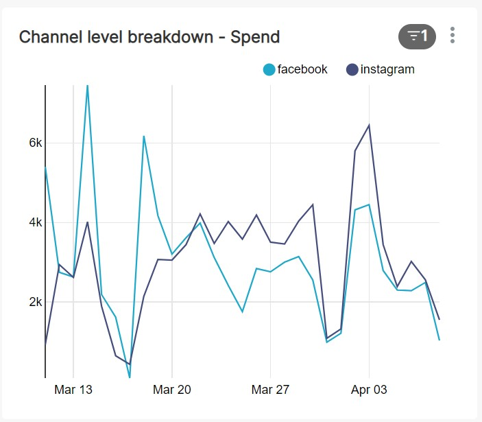
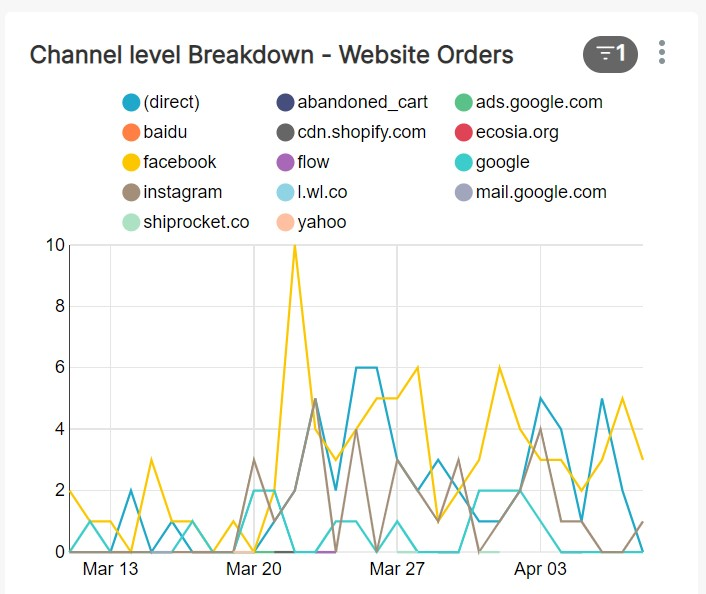
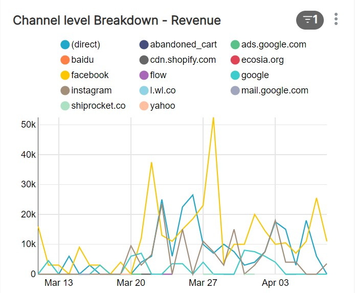

# Data Engineering Challenge

## Dataset
**Company X's** [social media data](https://drive.google.com/drive/folders/1P8GOk0DGW_JTjCPeM9P8LOnCLIXh7oGl?usp=sharing) comprises the following datasets

### Facebook
1. fb_daily_age_gender: Breakdown of daily facebook ads insights by age and gender.
2. fb_daily_publisher_platform: Breakdown of daily facebook ads insights by publisher platform(facebook/instagram).
3. fb_daily_region: Breakdown of daily facebook ads insights by region.

### Google Analytics
1. ga_daily: Daily E-commerce website stats from google analytics.

## Data Dictionaries
1. [Facebook](https://developers.facebook.com/docs/marketing-api/insights/parameters/v13.0) [See Fields section]
2. [Google Analytics](https://ga-dev-tools.web.app/dimensions-metrics-explorer/)

```
Hint: Its not necessary to use all of the above datasets in the tasks below. Figuring out what various fields in
 data mean and the relevance of datasets for problem at hand are necessary skills for any data enginner
  ```

## Tasks

## Task 1 - 20 Points
### Combining Facebook and Google Analytics data
Use pandas to combine data from facebook and google analytics to create a single "dashboard" data-frame that captures the
 amount spent each day on traffic from various channels. Final columns should look like the following:

1. Source: Source of traffic
2. Date: Date specifying the day these stats belong to. 
3. Sessions: Number of shopping sessions
4. Users: Number of unique users
5. Transactions: Number of transactions
6. Revenue: Total Revenue 
7. Order Quantity: Total number of orders
8. Transactions Per User: Avg number of transactions per user.
9. Amount Spent: Amount spent to gain traffic.
  
```Note: Amount spent on non-facebook/insta channels is currently 0. Final dashboard dataframe should reflect this.```

## Task 2 - 10 Points
### Host a Postgres server
Host a postgres server. There are several ways to accomplish this.
1. Using Heroku(*Recommended*) ([link](https://www.heroku.com/postgres)) : select the free "Hobby Dev" plan
2. On your localhost:
  - Using docker is one way to accomplish this. Refer to this [blog](https://towardsdatascience.com/how-to-run-postgresql-using-docker-15bf87b452d4)
  - Download and use the psql directly [link](https://www.postgresqltutorial.com/postgresql-getting-started/)
3. Use AWS RDS's free tier [link](https://aws.amazon.com/rds/free/)

## Task 3 - 30 Points
### Insert data to Postgres 
Sync the dashboard data-frame created in "Task 1" to the Postgres server hosted in "Task 2".
1. Create a primary key to uniquely identify each row in the dataframe.
2. Programmatically create a new schema for "Company X" called "company_x".
3. Insert the "dashboard" dataframe into a table named "general_dashboard" within the "company_x" schema.
4. BONUS: Can you think of an alternative operation to "insert" that is friendlier to updates? Implement this new operation. (+15 points) 

## Task 4 - 40 Points
### Apache Superset
Use Apache Superset to perform analysis on the "general_dashboard" Table.
1. Install/Host Apache Superset on localhost.
    - Use [Docker Compose](https://superset.apache.org/docs/installation/installing-superset-using-docker-compose/)(*Recommended*)
    - [Build locally](https://superset.apache.org/docs/installation/installing-superset-from-scratch)
    
2. Connect Apache Superset to Postgres database hosted in Task 2.
3. Import the "general_dashboard" table as a dataset in your Apache Superset server.
4. Create a dashboard in Apache Superset that helps us to understand the following in the "general_dashboard" dataset:
    - Channel level breakdown of spend.<br>
    <br>
    - Channel level breakdown of orders.<br>
    <br>
    - Channel level breakdown of revenue.<br>
    
 


 
